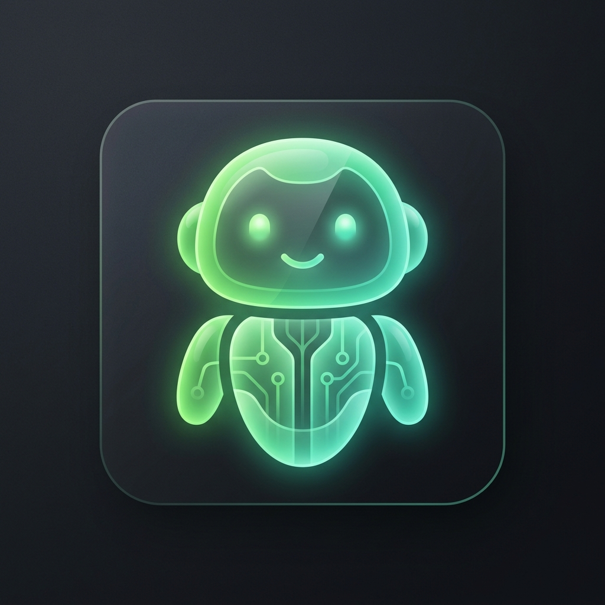

# 🤖 Buddy AI

> Local-first floating AI writing & vision assistant for Windows — powered by [Ollama](https://ollama.ai).



---

## ✨ Features

### 💬 Text Assistant
- **Floating bubble** — always-on-top, draggable, positioned bottom-right of your screen
- **Global hotkey** `Ctrl+Shift+E` — open the assistant from anywhere, any app
- **9 writing modes**: Enhance Prompt, Improve, Grammar Fix, Professional, Shorter, Friendly, Email, Continue, Answer
- **Streaming responses** — tokens appear in real-time as the model generates
- **Copy & Replace** — one-click to copy output or paste it directly into the original app
- **Retry** — re-run the same mode instantly without re-typing
- **Smart Answer mode** — splits output into a direct Solution + step-by-step Explanation panel

### 📸 Screen Capture & Vision
- **Full-screen snipping tool** — click "📸 Capture Screen" to open a native-style overlay
- **Interactive crop** — drag to select exactly what the AI should see; Esc to cancel
- **"What the model sees" preview** — displays the cropped region before sending
- **Auto-analysis** — vision model runs immediately after crop confirmation
- **Follow-up questions** — ask additional questions about the same screenshot
- **Re-crop** — grab a new region without losing the previous result

### ⚡ Quick Panel (Selection Icon)
- **Text selection detection** — a floating icon appears when you select text in any app
- **Instant actions** — Improve, Explain, Replace directly from the selection icon
- **Auto-replace** — pastes the result back into the originating application

### ⚙️ Settings
- **Dynamic model dropdowns** — automatically populated from your installed Ollama models
- **Text model** — choose any Ollama model for writing tasks
- **Vision model** — choose any vision-capable model (llava, minicpm-v, moondream, etc.)
- **Auto-save** — model selection saves instantly, no need to click Save
- **Start with Windows** — optional autostart via Windows registry

---

## 🚀 Quick Start

### Prerequisites
1. **[Ollama](https://ollama.ai/download)** — install and run `ollama serve`
2. **A text model** — `ollama pull qwen2.5:3b` (fast, recommended)
3. **A vision model** — `ollama pull llava` or `ollama pull minicpm-v` (for screen capture)

### Install & Run

**Option A — Download the installer**
1. Download `Buddy AI Setup 1.2.0.exe` from [Releases](https://github.com/hemanthdsd/buddy-ai/releases)
2. Run the installer (no admin required)
3. Launch **Buddy AI** from the Start Menu or Desktop shortcut

**Option B — Run from source**
```bash
git clone https://github.com/hemanthdsd/buddy-ai.git
cd buddy-ai
npm install
npm run dev
```

---

## 🔑 Keyboard Shortcuts

| Shortcut | Action |
|----------|--------|
| `Ctrl+Shift+E` | Open / focus assistant panel |
| `Esc` | Cancel screen capture / snip |
| `Enter` | Confirm crop selection |

---

## 🖼️ Recommended Vision Models

| Model | Size | Best For |
|-------|------|----------|
| `llava:latest` | 4.7 GB | General vision |
| `minicpm-v` | 5.5 GB | Best text/OCR reading |
| `moondream` | 1.7 GB | Fast, great at reading code |
| `llava-phi3` | 2.9 GB | Good balance |

```bash
ollama pull minicpm-v   # recommended for reading code/text from screen
```

---

## 🏗️ Build from Source

```bash
# Development
npm run dev

# Production installer (outputs to /release)
npm run dist
```

---

## 🛠️ Tech Stack

- **Electron** + **electron-vite** — desktop shell
- **React 18** + **TypeScript** — UI
- **Ollama** — local LLM inference (no cloud, no API key)
- **react-image-crop** — snipping tool crop selection
- **axios** — streaming HTTP to Ollama API

---

## 📁 Project Structure

```
src/
├── main/
│   ├── index.ts                    # App entry, window management
│   └── services/
│       ├── panel.service.ts        # Assistant panel + IPC handlers
│       ├── snip.service.ts         # Full-screen crop overlay
│       ├── ollama.service.ts       # LLM streaming
│       ├── selection.service.ts    # Text selection detection
│       ├── quick-panel.service.ts  # Quick action panel
│       ├── tray.service.ts         # System tray
│       ├── shortcut.service.ts     # Global hotkeys
│       └── settings.service.ts    # Persisted settings
├── preload/
│   └── index.ts                   # Secure IPC bridge
└── renderer/src/
    ├── App.tsx                     # Window router
    └── components/
        ├── Bubble.tsx              # Floating bubble
        ├── AssistantPanel.tsx      # Main assistant UI
        ├── SnipWindow.tsx          # Screen crop overlay
        ├── SelectionIcon.tsx       # Floating selection icon
        └── QuickPanel.tsx          # Quick action panel
```

---

## 📄 License

MIT — free to use, modify, and distribute.
